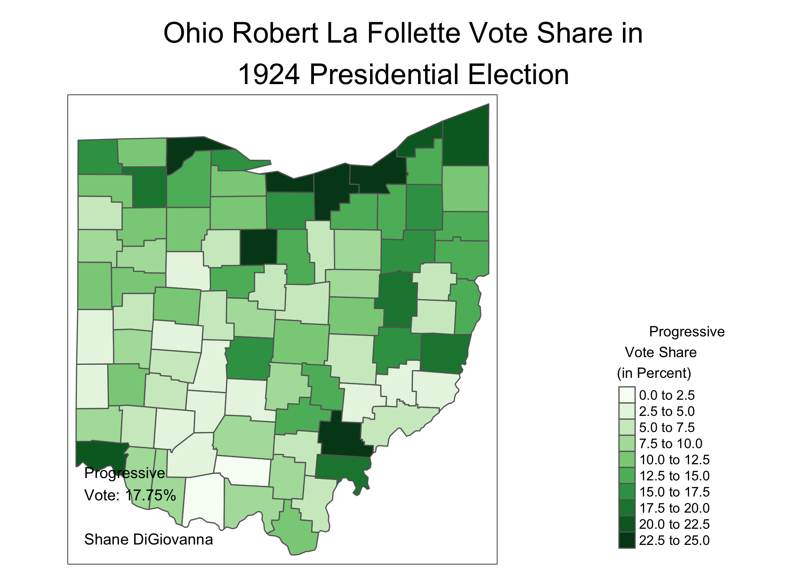

Roaring Twenties Elections in Ohio
================
Shane DiGiovanna
January 30, 2021

Introduction
============

The 1920s were a decade characterized by prosperity - earning the moniker "The Roaring Twenties" -, increasing income inequality, and Republican dominance of American politics. Today, we will look at the 1924 and 1928 Presidential elections in Ohio.

First Step: Downloading and Processing the Data
-----------------------------------------------

Data for this time period can be hard to find, so I have attached the county-level election data to my repository. It originally came from [ICPSR](https://www.icpsr.umich.edu/web/pages/), and I have done some preliminary processing to make the next steps easier. You can download my pre-processed data [here](https://raw.githubusercontent.com/shanedigiovanna/myrepotest1/main/Ohio%20Coolidge%20Hoover%20elections.csv). The county shapefile can be downloaded from [here](https://community.esri.com/t5/arcgis-enterprise-portal/where-can-i-find-a-shapefile-with-all-us-counties-and-fips-code/td-p/307592).

We will read in the data:

``` r
twenties_data <- read_csv("~/Desktop/R Stuff/Ohio Coolidge Hoover elections.csv")

county_shp <- st_read("/Users/shanedigiovanna/Downloads/UScounties/UScounties.shp")
```

    ## Reading layer `UScounties' from data source `/Users/shanedigiovanna/Downloads/UScounties/UScounties.shp' using driver `ESRI Shapefile'
    ## Simple feature collection with 3141 features and 5 fields
    ## geometry type:  MULTIPOLYGON
    ## dimension:      XY
    ## bbox:           xmin: -178.2176 ymin: 18.92179 xmax: -66.96927 ymax: 71.40624
    ## CRS:            4326

We need to filter `county_shp` to include only Ohio counties, and adjust the case of the county names in `twenties_data` to match those in `oh_county_shp`:

``` r
oh_county_shp <- county_shp %>%
filter(STATE_NAME == "Ohio")

twenties_data$COUNTY_NAME <- tolower(twenties_data$COUNTY_NAME)

twenties_data$COUNTY_NAME <- str_to_title(twenties_data$COUNTY_NAME)
```

Merge the two dataframes
------------------------

Next, we need to merge the election data, `twenties_data`, with the county shapefile, `oh_county_shp`:

``` r
twenties_elect <- full_join(twenties_data, oh_county_shp, by = c("COUNTY_NAME" = "NAME"))

#Make it into an sf
twenties_elect <- st_as_sf(twenties_elect)

##Create new columns

twenties_elect <- twenties_elect %>%
mutate(
per_dem_pres_24 = (pres_democratic_vote_24 / pres_total_vote_24)*100,
per_rep_pres_24 = (pres_republican_vote_24 / pres_total_vote_24)*100,
per_prog_pres_24 = (pres_progressive_vote_24 / pres_total_vote_24)*100,
per_dem_pres_28 = (pres_democratic_vote_28 / pres_total_vote_28)*100,
per_rep_pres_28 = (pres_republican_vote_28 / pres_total_vote_28)*100,
per_soc_pres_28 = (pres_socialist_vote_28 / pres_total_vote_28)*100,
per_proh_pres_28 = (pres_prohibition_vote_28 / pres_total_vote_28)*100
)

twenties_elect <- twenties_elect %>%
mutate(
d_r_pres_margin_24 = per_dem_pres_24 - per_rep_pres_24,
d_r_pres_margin_28 = per_dem_pres_28 - per_rep_pres_28
)

twenties_elect <- twenties_elect %>%
mutate(
margin_shift_24_28 = d_r_pres_margin_28 - d_r_pres_margin_24
)
```

Mapping
-------

Now that we have processed and merged our data, we can map it!

First up is the 1924 election that returned Calvin Coolidge to the White House:

``` r
oh_24_margin_map <- tm_shape(twenties_elect) + tm_polygons("d_r_pres_margin_24", palette = "RdBu", breaks = seq(-50, 50, by = 10),
title = "1924 D/R Margin\n(in Percent)", id = "district", popup.vars = c("Dem/Rep Pres Margin" = "d_r_pres_margin_24", "Dem %" = "per_dem_pres_24", 
    "Rep %" = "per_rep_pres_24")) + tm_view(alpha = 0.6, 
legend.position = c("right", "bottom")) +
    tm_layout(main.title = "Ohio 1924 Presidential\nParty Margin by County", main.title.position = "center", legend.title.size = 0.9, legend.outside = TRUE) +
    tm_credits(text = "\n\nShane DiGiovanna", position = c("left", "bottom"), size = 0.8)

oh_24_margin_map
```


Republican dominance continued with Herbert Hoovers election in 1928, as shown in this map:

``` r
oh_28_margin_map <- tm_shape(twenties_elect) + tm_polygons("d_r_pres_margin_28", palette = "RdBu", breaks = seq(-50, 50, by = 10),
title = "1928 D/R Margin\n(in Percent)", id = "district", popup.vars = c("Dem/Rep Pres Margin" = "d_r_pres_margin_28", "Dem %" = "per_dem_pres_28", 
    "Rep %" = "per_rep_pres_28")) + tm_view(alpha = 0.6, 
legend.position = c("right", "bottom")) +
    tm_layout(main.title = "Ohio 1928 Presidential Party Margin by County", main.title.position = "center", legend.title.size = 0.9, legend.outside = TRUE) +
    tm_credits(text = "Hoover won\nOhio by 30.44%\n\nShane DiGiovanna", position = c("left", "bottom"), size = 0.8)

oh_28_margin_map
```



Third Parties
-------------

Although Republicans swept the Presidential elections of the Roaring Twenties, third parties played a major role in national politics. These third parties were, in many ways, a symptom of the socioeconomic divide that grew over the decade, finally erupting with the Great Depression and the 1932 Democratic landslide.

In 1924, dissatisfied with the conservatism of both major parties, renowned Progressive Robert La Follette launched a major campaign that won his home state of Wisconsin. La Follette performed well in Ohio, getting 17.75%. He did especially well in industrial counties like Cuyahoga.

``` r
oh_24_prog_map <- tm_shape(twenties_elect) + tm_polygons("per_prog_pres_24", palette = "Greens", breaks = seq(0, 25, by = 2.5),
title = "        Progressive\n  Vote Share\n(in Percent)", id = "district", popup.vars = c("Progressive %" = "per_prog_pres_24")) + tm_view(alpha = 0.6, 
legend.position = c("right", "bottom")) +
    tm_layout(main.title = "Ohio Robert La Follette Vote Share in\n1924 Presidential Election", main.title.position = "center", legend.title.size = 0.9, legend.outside = TRUE) +
    tm_credits(text = "Progressive\nVote: 17.75%\n\nShane DiGiovanna", position = c("left", "bottom"), size = 0.8)

oh_24_prog_map
```


Conclusion
----------

The apparent prosperity of the 1920's ensured Republican political dominance in 1924 & 1928. However, La Follette's challenge in 1924 was a sign of political and economic discontent that would explode with the Great Depression. Although conservatism was the name of the game, Progressives like La Follette laid the groundwork for FDR's landslide in 1932.
